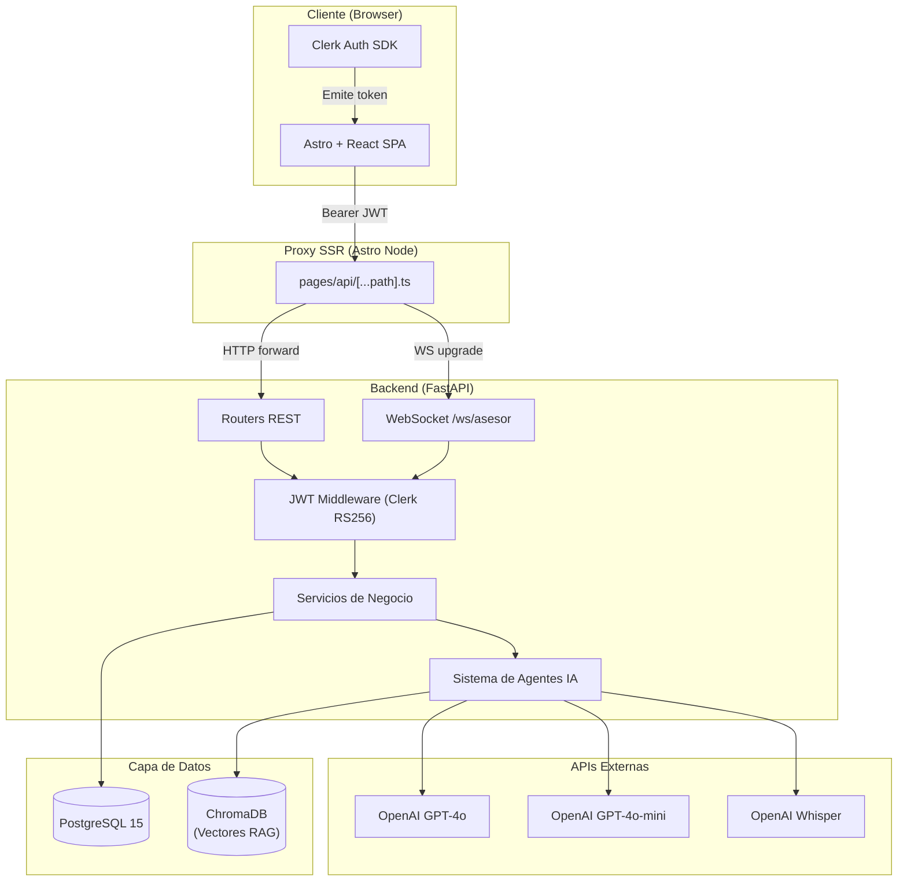
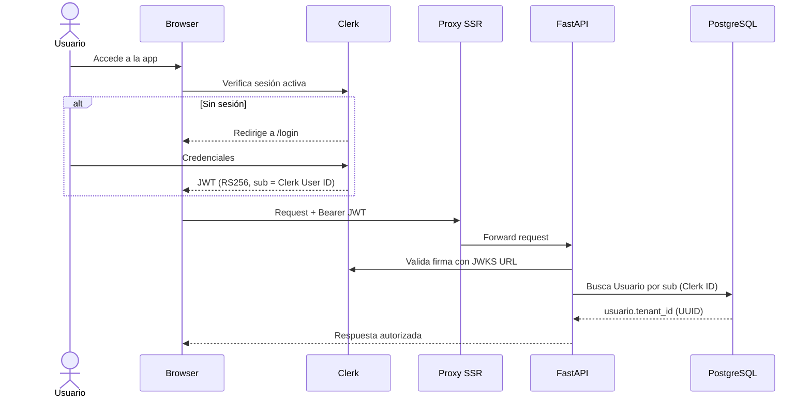
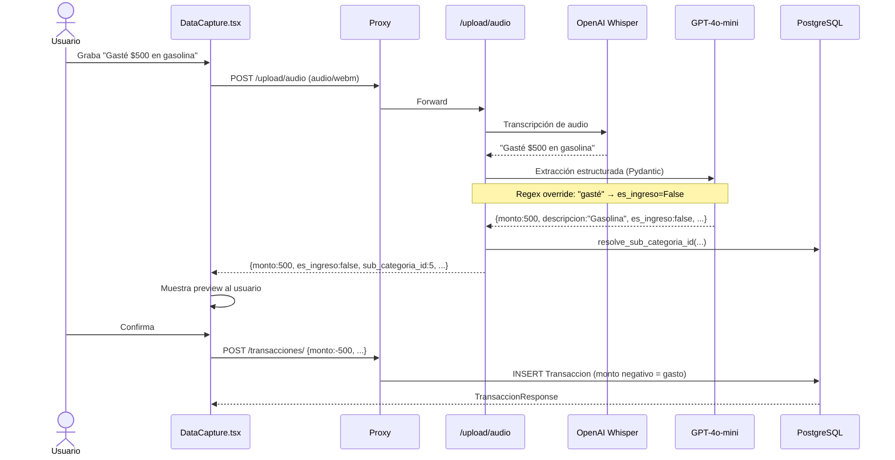
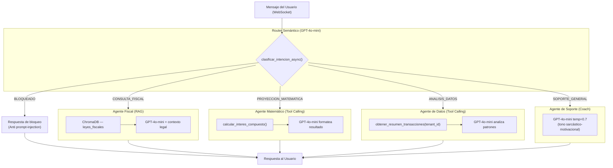
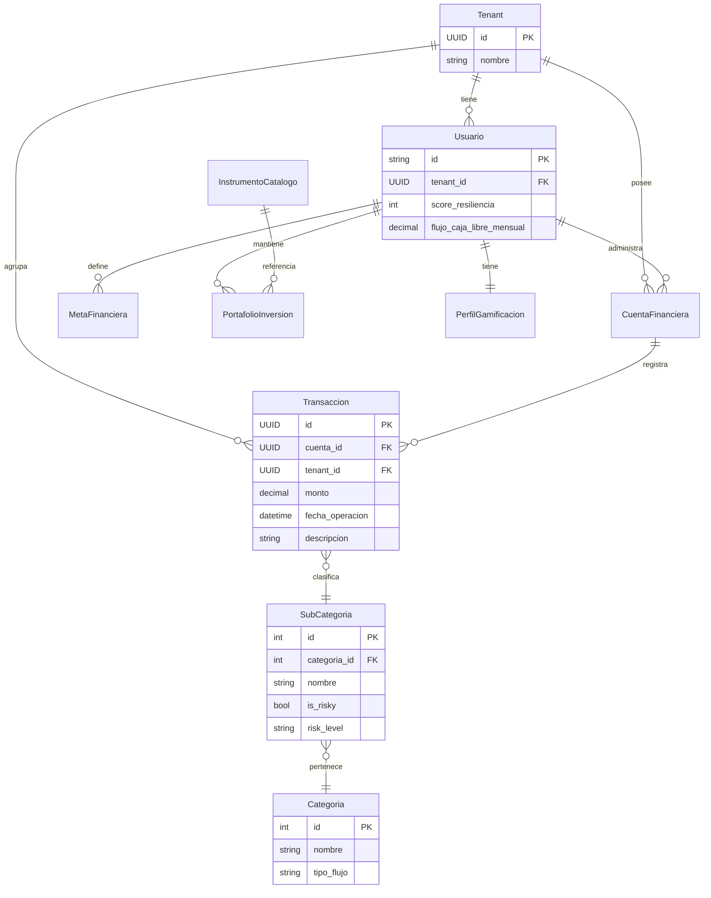

# Economity — Arquitectura del Sistema

Economity es una aplicación de finanzas personales con registro de transacciones asistido por IA multimodal (voz, imagen, texto), asesoría financiera conversacional mediante agentes especializados, y mecánicas de gamificación para fomentar hábitos económicos saludables.

---

## Estructura del Repositorio

```
talenthackathon-economity-core/
├── backend/          # API REST + WebSockets + Agentes IA (FastAPI + Python)
└── frontend/         # Interfaz de usuario (Astro + React + Tailwind)
```

---

## Visión General de la Arquitectura



---

## Stack Tecnológico

| Capa | Tecnología | Versión |
|------|-----------|---------|
| Frontend | Astro (SSR) | 6.1 |
| UI Components | React | 19.2 |
| Estilos | Tailwind CSS | 4.2 |
| Autenticación | Clerk | latest |
| Gráficos | Recharts | 2.15 |
| Backend | FastAPI + Uvicorn | ≥0.100 |
| ORM | SQLAlchemy | ≥2.0 |
| Base de Datos | PostgreSQL | 15 |
| Base Vectorial | ChromaDB | latest |
| IA / LLMs | OpenAI GPT-4o / mini | latest |
| Transcripción | OpenAI Whisper | whisper-1 |
| Orquestación IA | LangChain | ≥0.1 |
| Contenedores | Docker / Podman Compose | — |

---

## Flujo de Autenticación



La identidad del usuario es el `sub` del JWT (Clerk User ID, ej. `user_abc123`). El `tenant_id` (UUID) se resuelve siempre desde la base de datos — nunca se confía en el cliente para proveerlo (Zero-Trust).

---

## Flujo de Registro de Transacción por Voz



---

## Arquitectura del Sistema de Agentes IA



---

## Modelo de Datos Simplificado



> El signo del campo `monto` determina el tipo de transacción: **positivo = ingreso**, **negativo = gasto**.

---

## Convenciones del Proyecto

- **Aislamiento por tenant:** Toda consulta a la DB filtra por `tenant_id` resuelto desde el JWT, nunca desde el cliente.
- **Montos firmados:** El frontend envía y el backend almacena `monto` con signo para simplificar agregaciones.
- **Keyword override:** La clasificación `es_ingreso` del LLM puede ser sobreescrita por patrones regex (`gasté`, `gané`, etc.) para mayor determinismo.
- **Bootstrap idempotente:** `system_init.py` crea categorías, subcategorías y logros en producción sin depender de scripts de seed.
- **Contexto financiero fresco:** El WebSocket del asesor recalcula el resumen financiero en cada mensaje para evitar respuestas con datos obsoletos.

---

## Documentación Detallada

- [Backend — API, Agentes IA y Despliegue Local](./backend/README.md)
