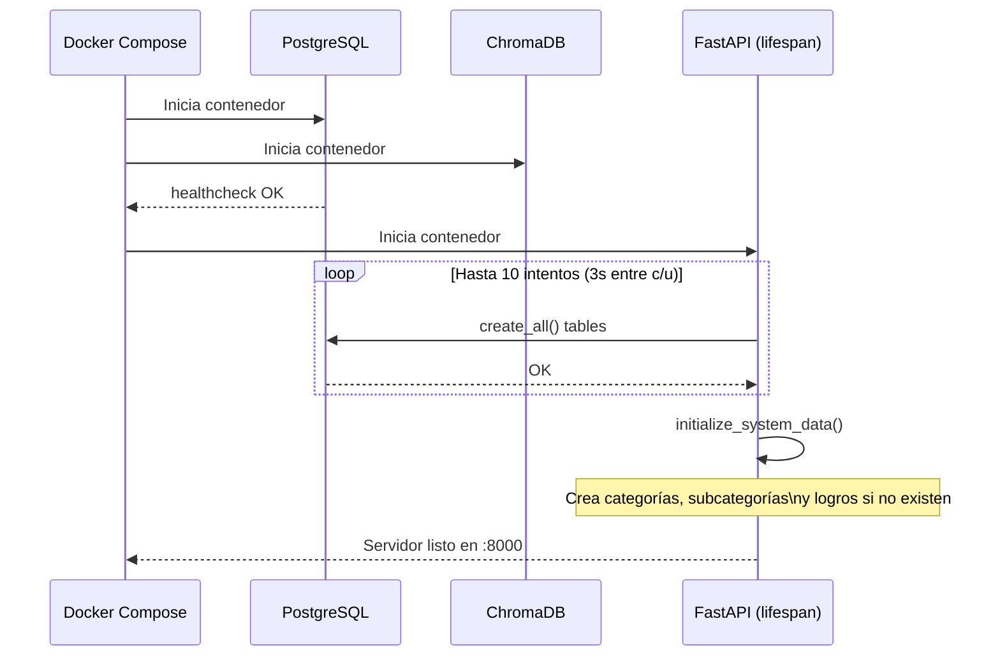
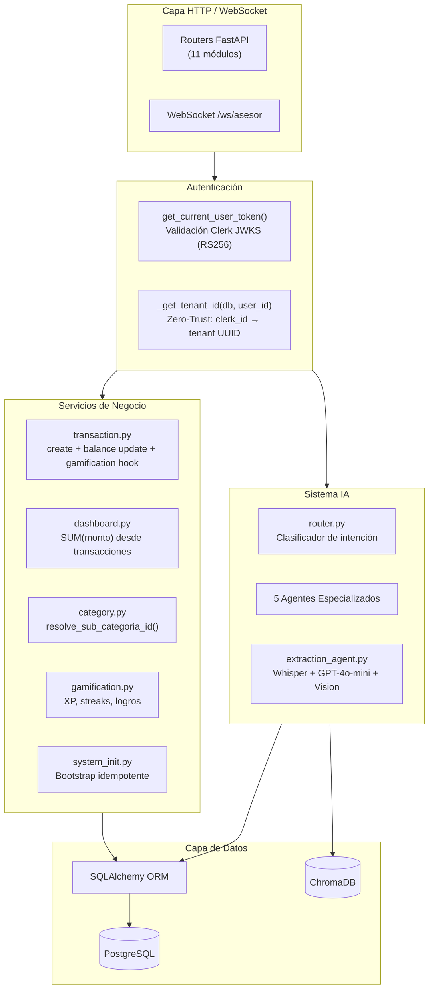
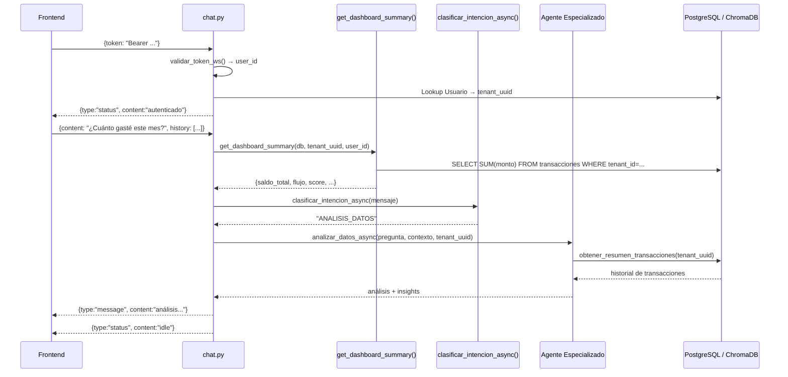
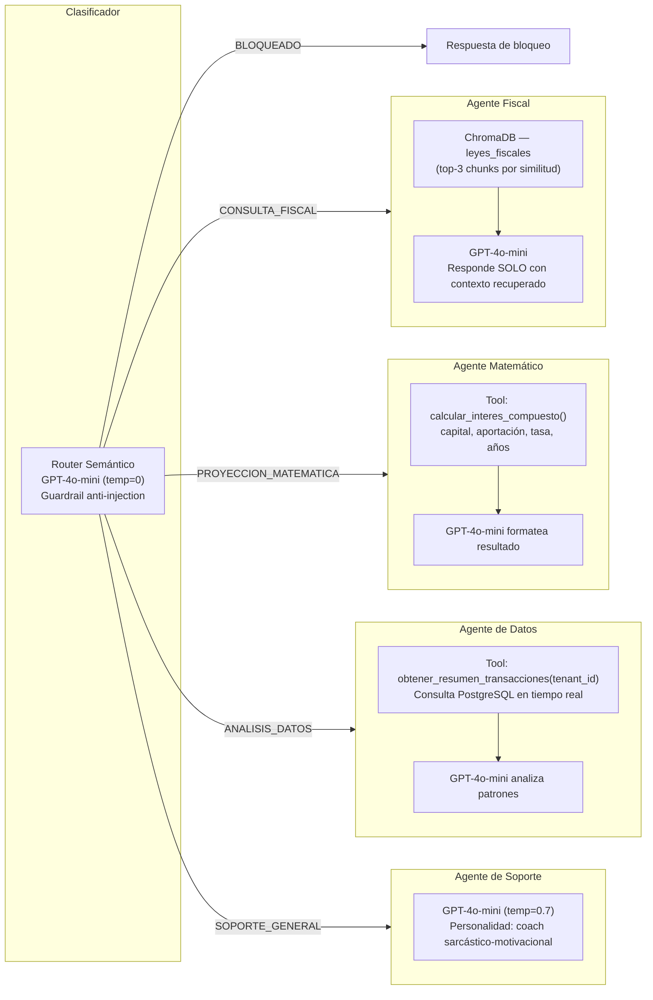
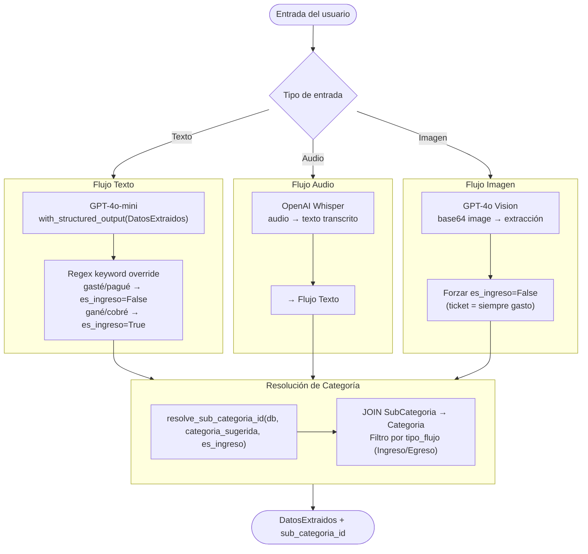
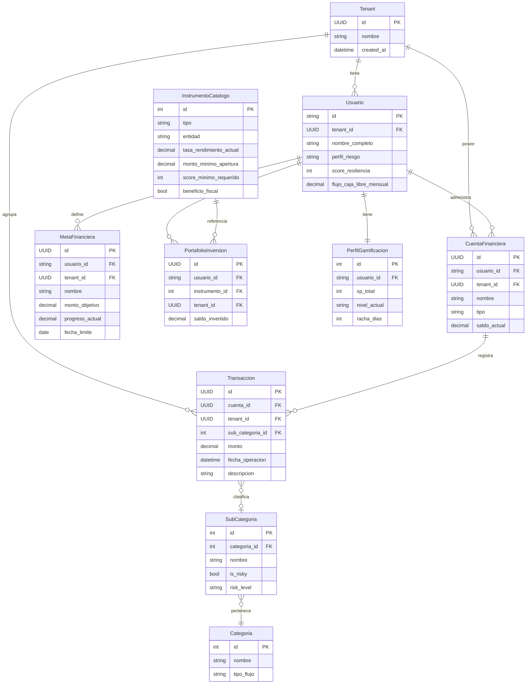
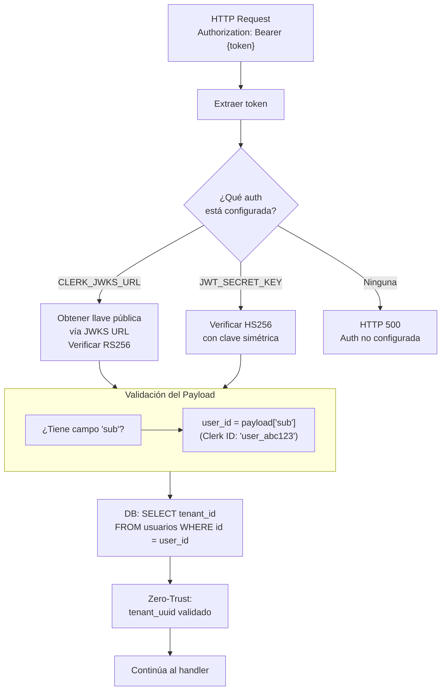
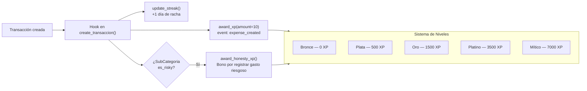

# Economity — Backend

API REST y sistema de agentes IA construido con **FastAPI**, **SQLAlchemy**, **LangChain** y **OpenAI**. Gestiona usuarios, transacciones financieras, portafolios de inversión, metas y asesoría conversacional en tiempo real.

---

## Índice

1. [Despliegue Local con Docker](#despliegue-local-con-docker)
2. [Estructura del Proyecto](#estructura-del-proyecto)
3. [Arquitectura de Capas](#arquitectura-de-capas)
4. [API — Endpoints](#api--endpoints)
5. [Sistema de Agentes IA](#sistema-de-agentes-ia)
6. [Extracción Multimodal](#extracción-multimodal)
7. [Modelo de Datos](#modelo-de-datos)
8. [Autenticación y Seguridad](#autenticación-y-seguridad)
9. [Gamificación](#gamificación)
10. [Variables de Entorno](#variables-de-entorno)
11. [Testing](#testing)

---

## Despliegue Local con Docker

### Prerrequisitos

- [Docker](https://docs.docker.com/get-docker/) ≥ 24 **o** [Podman](https://podman.io/) ≥ 4.x con `podman-compose`
- Clave de API de OpenAI (`OPENAI_API_KEY`)
- Proyecto de Clerk configurado (para autenticación)

### 1. Clonar el repositorio

```bash
git clone https://github.com/Mozcko/talenthackathon-economity-core.git
cd talenthackathon-economity-core/backend
```

### 2. Configurar variables de entorno

```bash
cp .env.example .env
```

Editar `.env` con los valores reales:

```env
# Base de datos — NO modificar si usas Docker Compose
DATABASE_URL=postgresql://economity_admin:economity_password@db:5432/economity_dev

# ChromaDB — NO modificar si usas Docker Compose
CHROMA_URL=http://chromadb:8000

# Autenticación Clerk (Opción A — recomendada)
# Obtener en: Clerk Dashboard > API Keys > JWKS URL
CLERK_JWKS_URL=https://tu-dominio.clerk.accounts.dev/.well-known/jwks.json

# Autenticación simétrica (Opción B — solo para desarrollo/testing)
# JWT_SECRET_KEY=una-clave-secreta-para-tests

# OpenAI (obligatorio)
OPENAI_API_KEY=sk-...
```

> **Nota:** El campo `DATABASE_URL` usa el nombre de servicio `db` (hostname interno de Docker), no `localhost`.

### 3. Construir y levantar los servicios

```bash
# Con Docker
docker compose up --build

# Con Podman
podman-compose up --build
```

Esto levanta **3 contenedores**:

| Servicio | Imagen | Puerto local | Descripción |
|----------|--------|-------------|-------------|
| `db` | `postgres:15-alpine` | `5432` | Base de datos relacional |
| `chromadb` | `chromadb/chroma:latest` | `8001` | Base de datos vectorial (RAG) |
| `api` | Dockerfile local | `8000` | FastAPI + Agentes IA |

El servicio `api` espera a que `db` pase su health check antes de iniciar. Al arrancar ejecuta automáticamente:
- `Base.metadata.create_all()` — crea todas las tablas si no existen (con reintentos)
- `initialize_system_data()` — inicializa categorías, subcategorías y logros (idempotente)

### 4. Verificar el despliegue

```bash
# Health check de la API
curl http://localhost:8000/

# Documentación interactiva (Swagger UI)
# Abrir en el navegador:
http://localhost:8000/docs

# Documentación alternativa (ReDoc)
http://localhost:8000/redoc
```

### 5. Flujo de arranque



### 6. Comandos útiles

```bash
# Ver logs en tiempo real
docker compose logs -f api

# Reiniciar solo la API (sin reconstruir)
docker compose restart api

# Acceder a la base de datos directamente
docker compose exec db psql -U economity_admin -d economity_dev

# Detener todos los servicios
docker compose down

# Detener y eliminar volúmenes (¡borra todos los datos!)
docker compose down -v

# Reconstruir solo la imagen de la API
docker compose build api
```

### 7. Despliegue sin Docker (modo desarrollo)

```bash
# Requiere: PostgreSQL y ChromaDB corriendo localmente

cd backend
python -m venv venv
source venv/bin/activate          # Windows: venv\Scripts\activate
pip install -r requirements.txt

# Ajustar DATABASE_URL y CHROMA_URL en .env para apuntar a localhost

uvicorn src.main:app --reload --port 8000
```

---

## Estructura del Proyecto

```
backend/
├── src/
│   ├── main.py                  # Punto de entrada, lifespan, CORS, routers
│   ├── core/
│   │   ├── config.py            # Settings (Pydantic BaseSettings)
│   │   ├── database.py          # Engine, SessionLocal, get_db()
│   │   └── security.py          # Validación JWT Clerk (RS256 / HS256)
│   ├── models/                  # ORM SQLAlchemy
│   │   ├── user.py              # Usuario, CuentaFinanciera
│   │   ├── tenant.py            # Tenant (aislamiento multi-tenant)
│   │   ├── transaction.py       # Transaccion, Categoria, SubCategoria
│   │   ├── goal.py              # MetaFinanciera
│   │   ├── investment.py        # InstrumentoCatalogo, PortafolioInversion
│   │   └── gamification.py      # PerfilGamificacion, LogroUsuario
│   ├── schemas/                 # Pydantic v2 request/response
│   ├── api/
│   │   └── routers/             # Un archivo por dominio
│   │       ├── user.py
│   │       ├── transaction.py
│   │       ├── upload.py        # Extracción IA (sin guardar)
│   │       ├── investment.py
│   │       ├── goal.py
│   │       ├── gamification.py
│   │       ├── dashboard.py
│   │       ├── category.py
│   │       ├── tenant.py
│   │       └── chat.py          # WebSocket /ws/asesor
│   └── services/
│       ├── transaction.py       # CRUD + hook gamificación + actualiza saldo
│       ├── dashboard.py         # Resumen financiero calculado desde transacciones
│       ├── category.py          # resolve_sub_categoria_id()
│       ├── gamification.py      # XP, streaks, logros
│       ├── system_init.py       # Bootstrap de datos de referencia (producción)
│       └── ai/
│           ├── router.py        # Clasificador semántico de intenciones
│           ├── memory.py        # Formateo del historial de conversación
│           ├── multimodal_parser.py  # Parser síncrono (ruta /transacciones)
│           └── agents/
│               ├── extraction_agent.py  # Extracción multimodal asíncrona
│               ├── data_agent.py        # Análisis de gastos con tool-calling
│               ├── math_agent.py        # Proyecciones de inversión
│               ├── fiscal_agent.py      # RAG sobre leyes fiscales
│               └── support_agent.py    # Coach motivacional
├── test/                        # Pruebas unitarias (pytest)
├── docker-compose.yml
├── Dockerfile
├── requirements.txt
├── .env.example
└── pytest.ini
```

---

## Arquitectura de Capas



---

## API — Endpoints

### Usuarios y Cuentas `/usuarios`

| Método | Ruta | Descripción |
|--------|------|-------------|
| `POST` | `/usuarios/` | Crear usuario |
| `GET` | `/usuarios/{user_id}` | Obtener perfil |
| `POST` | `/usuarios/{user_id}/cuentas/` | Crear cuenta financiera |
| `GET` | `/usuarios/{user_id}/cuentas/` | Listar cuentas |

### Transacciones `/transacciones`

| Método | Ruta | Descripción |
|--------|------|-------------|
| `POST` | `/transacciones/` | Registrar transacción manual |
| `GET` | `/transacciones/cuenta/{cuenta_id}` | Historial de cuenta |
| `POST` | `/transacciones/cuenta/{id}/audio` | Registrar por voz (Whisper + GPT) |
| `POST` | `/transacciones/cuenta/{id}/imagen` | Registrar por ticket foto (GPT-4o Vision) |
| `DELETE` | `/transacciones/{id}` | Eliminar transacción |

### Extracción IA (preview sin guardar) `/upload`

| Método | Ruta | Descripción |
|--------|------|-------------|
| `POST` | `/upload/texto` | Extraer datos de texto libre |
| `POST` | `/upload/audio` | Transcribir audio y extraer |
| `POST` | `/upload/imagen` | Analizar imagen de ticket |

### Inversiones `/inversiones`

| Método | Ruta | Descripción |
|--------|------|-------------|
| `GET` | `/inversiones/tierlist` | Tier list personalizada de instrumentos |
| `POST` | `/inversiones/portafolio` | Registrar inversión |
| `GET` | `/inversiones/portafolio` | Ver portafolio |

### Metas Financieras `/metas`

| Método | Ruta | Descripción |
|--------|------|-------------|
| `POST` | `/metas/` | Crear meta |
| `GET` | `/metas/` | Listar metas del usuario |
| `PATCH` | `/metas/{id}/progreso` | Sumar avance (`?monto_a_sumar=500`) |
| `DELETE` | `/metas/{id}` | Eliminar meta |

### Otros

| Prefijo | Descripción |
|---------|-------------|
| `/dashboard/summary` | Resumen: saldo, flujo, score, meta próxima |
| `/gamification/profile` | XP, nivel, racha |
| `/gamification/achievements` | Logros desbloqueados |
| `/categorias/` | Catálogo completo de categorías y subcategorías |
| `/organizaciones/` | Gestión de tenant |
| `WS /ws/asesor` | Chat con el asesor IA |

---

## Sistema de Agentes IA

El asesor financiero es un sistema multi-agente que recibe preguntas por WebSocket, clasifica la intención y delega a un agente especializado.

### Flujo del WebSocket `/ws/asesor`



### Agentes Especializados



| Agente | Modelo | Técnica | Fuente de datos |
|--------|--------|---------|----------------|
| Fiscal | GPT-4o-mini | RAG | ChromaDB (leyes_fiscales) |
| Matemático | GPT-4o-mini | Tool calling | Cálculo local (interés compuesto) |
| Datos | GPT-4o-mini | Tool calling | PostgreSQL (transacciones reales) |
| Soporte | GPT-4o-mini | Prompt engineering | Historial de conversación |

---

## Extracción Multimodal

El módulo `extraction_agent.py` procesa tres tipos de entrada para extraer transacciones estructuradas.



### Esquema `DatosExtraidos`

```python
class DatosExtraidos(BaseModel):
    monto: float              # Siempre positivo (el signo se aplica al guardar)
    descripcion: str          # Ej. "Gasolina Pemex", "Sueldo Enero"
    es_ingreso: bool          # True SOLO para salario/venta/cobro
    categoria_sugerida: str   # Ej. "Transporte/Gasolina", "Sueldo/Nómina"
    es_riesgoso: bool         # True para apuestas, alcohol, compras impulsivas
```

---

## Modelo de Datos



### Categorías predefinidas (`system_init.py`)

| Categoría | Tipo | Subcategorías (ejemplos) |
|-----------|------|--------------------------|
| Ingresos | Ingreso | Sueldo/Nómina, Freelance/Honorarios, Venta |
| Supervivencia Esenciales | Egreso | Renta/Vivienda, Despensa/Súper, Transporte/Gasolina |
| Crecimiento y Salud | Egreso | Gym/Deporte, Educación/Cursos, Médico |
| Dopamina y Riesgo | Egreso ⚠️ | Apuestas/Casino, Alcohol, Antros/Fiesta, Skins/Games |
| Otros | Egreso | Varios/Sin categoría |

---

## Autenticación y Seguridad



**Principios de seguridad implementados:**
- **Zero-Trust:** El `tenant_id` siempre se resuelve desde la DB, nunca desde el cliente
- **Aislamiento por tenant:** Toda consulta filtra por `tenant_id` en la capa de servicio
- **Guardrail de prompt injection:** El clasificador semántico bloquea intentos de manipulación del agente
- **Monto firmado:** El signo del monto lo define el backend (nunca el cliente) basado en `es_ingreso`

---

## Gamificación



Rutas adicionales de XP:
- `audio_log_bonus` (+5 XP) — por registrar transacción por voz
- `image_log_bonus` (+10 XP) — por registrar transacción por foto de ticket

---

## Variables de Entorno

| Variable | Requerida | Descripción |
|----------|-----------|-------------|
| `DATABASE_URL` | ✅ | Cadena de conexión PostgreSQL |
| `OPENAI_API_KEY` | ✅ | Clave de API de OpenAI |
| `CLERK_JWKS_URL` | ⚠️ uno de los dos | URL JWKS para validación RS256 (Clerk) |
| `JWT_SECRET_KEY` | ⚠️ uno de los dos | Clave simétrica HS256 (solo dev/testing) |
| `CHROMA_URL` | — | URL de ChromaDB (default: `http://localhost:8001`) |
| `DEEPSEEK_API_KEY` | — | Opcional, no usado activamente |
| `CLAUDECODE_API_KEY` | — | Opcional, no usado activamente |

---

## Testing

```bash
# Activar el entorno virtual
source venv/bin/activate

# Ejecutar todas las pruebas
venv/bin/pytest -v

# Ejecutar un módulo específico
venv/bin/pytest test/test_transaction_service.py -v

# Con reporte de cobertura (requiere pytest-cov)
venv/bin/pytest --cov=src --cov-report=term-missing
```

Las pruebas unitarias usan `MagicMock` y `AsyncMock` para aislar la base de datos y los servicios externos (OpenAI, Clerk). No requieren servicios externos levantados.

```
test/
├── test_transaction_service.py    # CRUD de transacciones + gamification hook
├── test_dashboard_service.py      # Resumen financiero calculado desde transacciones
├── test_upload.py                 # Endpoints de extracción IA (/upload/*)
├── test_gamification_service.py   # XP, niveles, logros
├── test_category_service.py       # Resolución de subcategorías
├── test_user_service.py           # Usuarios y cuentas
├── test_goal_service.py           # Metas financieras
├── test_tenant_service.py         # Multi-tenant
├── test_investment_service.py     # Portafolio e instrumentos
└── test_ws_client.py              # Cliente WebSocket del asesor
```
