# Economity — Frontend

Interfaz web de la plataforma de finanzas personales Economity. Construida con **Astro** (SSR) e islas de **React** para los componentes interactivos. Se comunica con el backend mediante un proxy HTTP y una conexión WebSocket para el asesor financiero en tiempo real.

---

## Índice

1. [Stack Tecnológico](#stack-tecnológico)
2. [Estructura del Proyecto](#estructura-del-proyecto)
3. [Arquitectura General](#arquitectura-general)
4. [Despliegue Local](#despliegue-local)
5. [Variables de Entorno](#variables-de-entorno)
6. [Autenticación y Sesión](#autenticación-y-sesión)
7. [Sistema de Enrutamiento (Páginas)](#sistema-de-enrutamiento-páginas)
8. [Proxy Reverso al Backend](#proxy-reverso-al-backend)
9. [Contexto de Aplicación — `api.ts`](#contexto-de-aplicación--apits)
10. [Componentes Astro (Shell)](#componentes-astro-shell)
11. [Componentes React (Islas Interactivas)](#componentes-react-islas-interactivas)
12. [Sistema de Diseño](#sistema-de-diseño)
13. [Comunicación con el Backend](#comunicación-con-el-backend)
14. [Chat en Tiempo Real — WebSocket](#chat-en-tiempo-real--websocket)

---

## Stack Tecnológico

| Tecnología | Versión | Rol |
|-----------|---------|-----|
| Astro | 6.1 | Framework SSR, routing, layouts, middleware |
| React | 19.2 | Componentes interactivos (islas) |
| TypeScript | strict | Tipado estático en todos los módulos |
| Tailwind CSS | 4.2 | Utilidades de estilo + tokens de diseño |
| Clerk | @astro 3 / @react 6 | Autenticación (OAuth, JWT RS256) |
| Recharts | 2.15 | Gráficos (PieChart responsivo) |
| Vite | 6.4 | Bundler y servidor de desarrollo |
| Node.js | ≥22.12 | Adaptador de servidor (modo standalone) |

---

## Estructura del Proyecto

```
frontend/
├── src/
│   ├── assets/                        # Imágenes estáticas (mascota Rudy, íconos)
│   ├── components/
│   │   ├── Astro/                     # Shell: estructura y navegación (no interactivos)
│   │   │   ├── Navbar.astro
│   │   │   ├── Sidebar.astro
│   │   │   ├── Dashboard.astro
│   │   │   ├── Transaction.astro
│   │   │   ├── Vault.astro
│   │   │   ├── Insights.astro
│   │   │   ├── Metas.astro
│   │   │   ├── Chat.astro
│   │   │   └── Social.astro
│   │   └── React/                     # Islas React (hidratadas en cliente)
│   │       ├── Chat/
│   │       │   └── Chat.jsx           # Asesor IA por WebSocket
│   │       ├── Dashboard/
│   │       │   ├── Dashboard.tsx      # Presentación con mascota Rudy
│   │       │   ├── DataCapture.tsx    # Captura multimodal de transacciones
│   │       │   └── Opportunities.tsx  # Oportunidades de inversión
│   │       ├── Gamification/
│   │       │   └── GamificationProfile.tsx
│   │       ├── Goals/
│   │       │   └── GoalsDashboard.tsx
│   │       ├── Social/
│   │       │   └── FriendList.tsx
│   │       ├── Transaction/
│   │       │   └── TransactionList.tsx
│   │       └── Vault/
│   │           ├── VaultDashboard.tsx
│   │           ├── SummaryCard.tsx
│   │           ├── InvestmentCard.tsx
│   │           └── AssetDistributionChart.tsx
│   ├── layouts/
│   │   └── Layout.astro               # HTML base: fuentes, Navbar, <slot/>
│   ├── lib/
│   │   └── api.ts                     # Contexto de app, auth headers, apiFetch
│   ├── middleware.ts                  # Guard de autenticación Clerk
│   ├── pages/
│   │   ├── index.astro                # Dashboard principal (tab router)
│   │   ├── login.astro                # Formulario de inicio de sesión Clerk
│   │   └── api/
│   │       └── [...path].ts           # Proxy reverso al backend FastAPI
│   └── styles/
│       └── global.css                 # Tokens de diseño y componentes Tailwind
├── public/
│   └── favicon.svg
├── astro.config.mjs                   # Integraciones, proxy de dev, adaptador
├── package.json
└── tsconfig.json
```

---

## Arquitectura General

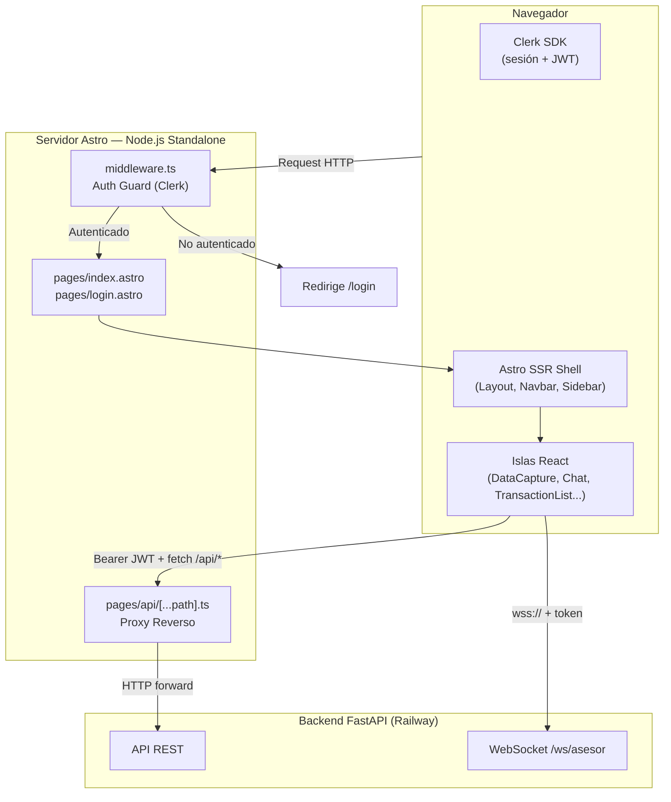

### Modelo de Islas (Astro Islands)

Astro renderiza el HTML estático en el servidor y solo hidrata en el cliente los componentes marcados con `client:load`. Esto minimiza el JavaScript enviado al navegador.

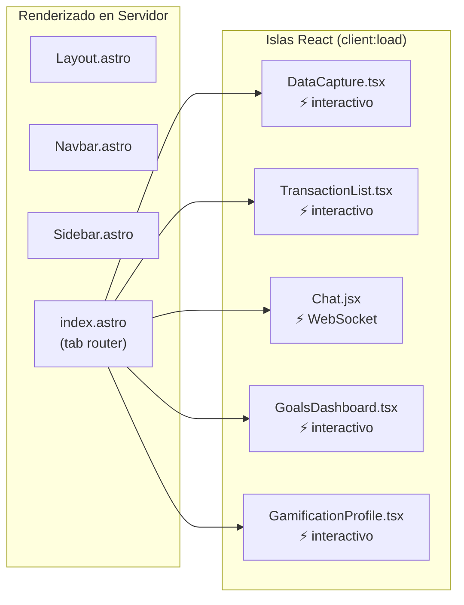

---

## Despliegue Local

### Prerrequisitos

- Node.js ≥ 22.12 (recomendado: usar [nvm](https://github.com/nvm-sh/nvm))
- Backend corriendo (ver [backend/README.md](../backend/README.md))
- Proyecto de Clerk configurado

### 1. Instalar dependencias

```bash
cd frontend
npm install
```

### 2. Configurar variables de entorno

```bash
cp .env.example .env.local   # Si existe, o crear manual
```

Crear el archivo `.env.local` con los valores correspondientes:

```env
# Clerk — Obtener en: https://dashboard.clerk.com > API Keys
PUBLIC_CLERK_PUBLISHABLE_KEY=pk_test_...
CLERK_SECRET_KEY=sk_test_...

# URL del backend (local con Docker Compose)
PUBLIC_API_URL=http://localhost:8000
```

### 3. Iniciar servidor de desarrollo

```bash
npm run dev
```

El servidor de desarrollo estará disponible en `http://localhost:4321`.

En modo `dev`, Astro aplica el proxy definido en `astro.config.mjs`:

```
/api/transacciones/* → http://localhost:8000/transacciones/*
/api/upload/*        → http://localhost:8000/upload/*
...
```

### 4. Build de producción

```bash
# Compilar
npm run build

# Previsualizar el build localmente
npm run preview

# Iniciar el servidor de producción (tras build)
npm run start
```

El servidor de producción ejecuta `node dist/server/entry.mjs` (adaptador Node standalone).

### 5. Scripts disponibles

| Script | Comando | Descripción |
|--------|---------|-------------|
| `dev` | `astro dev` | Servidor de desarrollo con HMR |
| `build` | `astro build` | Compilación optimizada para producción |
| `preview` | `astro preview` | Servidor de preview del build |
| `start` | `node dist/server/entry.mjs` | Servidor de producción |

---

## Variables de Entorno

| Variable | Visibilidad | Requerida | Descripción |
|----------|------------|-----------|-------------|
| `PUBLIC_CLERK_PUBLISHABLE_KEY` | Cliente + Servidor | ✅ | Clave pública de Clerk |
| `CLERK_SECRET_KEY` | Solo Servidor | ✅ | Clave secreta de Clerk (middleware SSR) |
| `PUBLIC_API_URL` | Cliente + Servidor | ✅ | URL base del backend FastAPI |

> Las variables con prefijo `PUBLIC_` son accesibles desde el cliente. Las demás solo están disponibles en el contexto del servidor (Node.js).

---

## Autenticación y Sesión

### Middleware de ruta (`middleware.ts`)

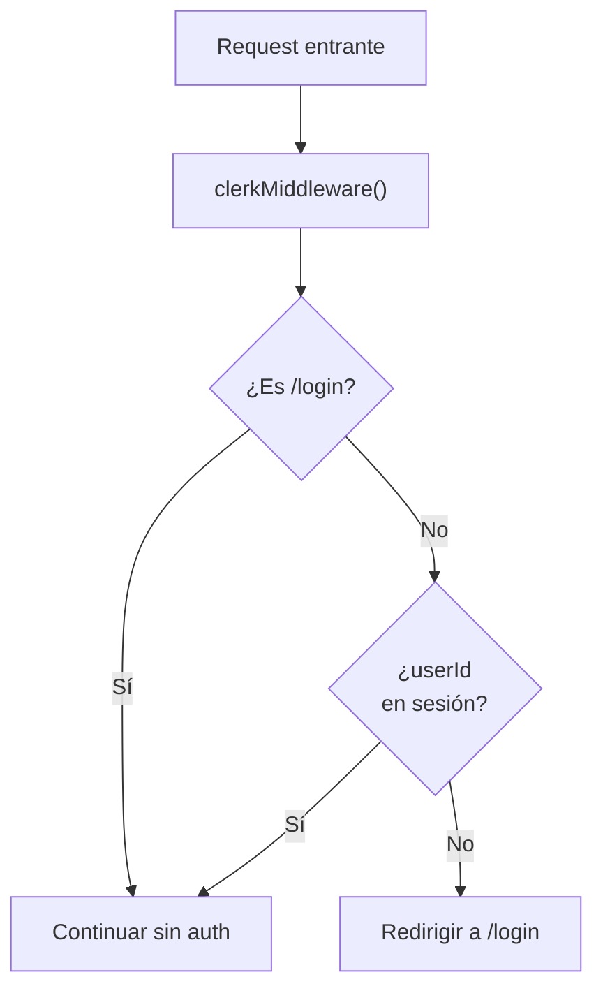

Todas las rutas excepto `/login` requieren sesión activa. Si no existe, el middleware redirige automáticamente.

### Flujo completo de autenticación

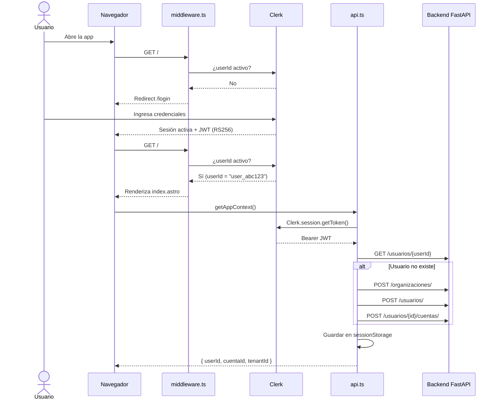

### Caché del contexto (`sessionStorage`)

`getAppContext()` es una promesa singleton que se resuelve una sola vez por sesión. Los valores se almacenan en `sessionStorage` con la clave del `userId` de Clerk para evitar llamadas repetidas entre navegaciones.

```
sessionStorage["economity_ctx_{userId}"] = {
  userId: "user_abc123",
  cuentaId: "550e8400-...",
  tenantId: "6ba7b810-..."
}
```

Si el `userId` activo de Clerk no coincide con el guardado, el caché se invalida y se re-provisiona.

---

## Sistema de Enrutamiento (Páginas)

### `pages/index.astro` — Dashboard principal

La página principal es un **tab router** basado en el query param `?tab`. Renderiza el componente Astro correspondiente según la pestaña activa.

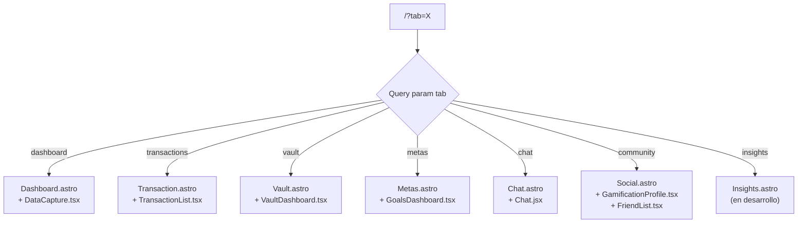

Layout de la pantalla principal: columna izquierda fija con `Sidebar.astro` + área de contenido principal.

### `pages/login.astro` — Inicio de sesión

Diseño de dos paneles:
- **Izquierdo:** Formulario de Clerk (`<SignIn>`) — renderiza el widget oficial
- **Derecho:** Propuesta de valor de la app (oculto en móvil)

---

## Proxy Reverso al Backend

### `pages/api/[...path].ts`

Todas las peticiones a `/api/*` pasan por este handler que las reenvía al backend FastAPI. Esto evita problemas de CORS y centraliza la URL del backend en una variable de entorno del servidor.

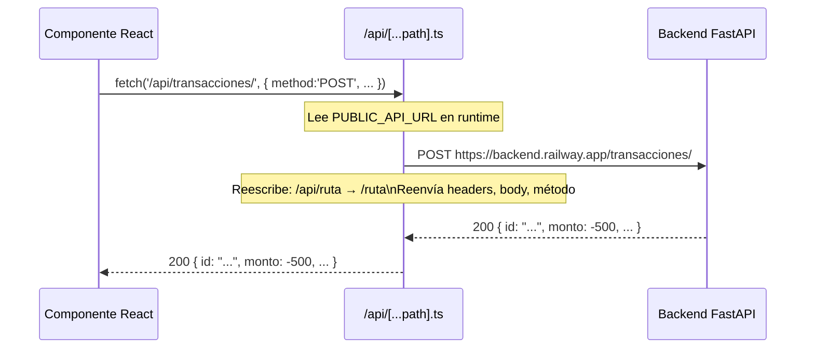

El proxy maneja:
- Todos los métodos HTTP (GET, POST, PUT, PATCH, DELETE)
- Cuerpos binarios/multipart (`FormData` para archivos de audio e imagen)
- Propagación de errores con códigos `502` (backend caído) y `503` (sin configuración)
- La variable `PUBLIC_API_URL` se lee en **tiempo de ejecución** (compatible con Railway, donde las env vars se inyectan en runtime)

---

## Contexto de Aplicación — `api.ts`

Módulo central de comunicación. Exporta tres utilidades que usan todos los componentes React.

### `getAppContext(): Promise<AppContext>`

Auto-provisiona el usuario en el backend en el primer login y cachea el resultado.

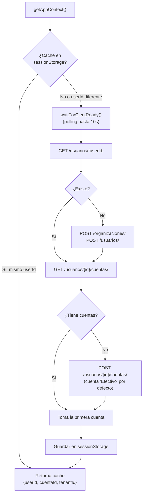

### `getAuthHeaders(): Promise<Record<string, string>>`

Obtiene el token JWT de la sesión activa de Clerk y lo formatea como header HTTP.

```typescript
// Retorna:
{ "Authorization": "Bearer eyJhbGci..." }
```

### `apiFetch<T>(path, options): Promise<T>`

Wrapper de `fetch()` que inyecta automáticamente el header de autenticación. Todos los componentes React usan esta función en lugar de `fetch()` directamente.

```typescript
// Uso típico en un componente
const data = await apiFetch<Transaccion[]>(`/transacciones/cuenta/${cuentaId}`);
```

Lanza un `Error` con el mensaje del backend si la respuesta no es `2xx`.

---

## Componentes Astro (Shell)

Los componentes Astro se renderizan en el servidor y no tienen estado en cliente. Funcionan como contenedores estructurales que montan las islas React.

| Componente | Descripción | Monta isla React |
|-----------|-------------|-----------------|
| `Layout.astro` | HTML base, fuentes Google (Inter + Manrope), slot | — |
| `Navbar.astro` | Barra superior fija: logo, notificaciones, `UserButton` Clerk | — |
| `Sidebar.astro` | Navegación vertical con íconos y tabs activos | — |
| `Dashboard.astro` | Contenedor del panel principal | `Dashboard.tsx`, `DataCapture.tsx` |
| `Transaction.astro` | Vista de historial | `TransactionList.tsx` |
| `Vault.astro` | Vista de inversiones y distribución | `VaultDashboard.tsx` |
| `Metas.astro` | Vista de metas financieras | `GoalsDashboard.tsx` |
| `Chat.astro` | Contenedor del asesor IA | `Chat.jsx` |
| `Social.astro` | Comunidad: amigos y gamificación | `GamificationProfile.tsx`, `FriendList.tsx` |
| `Insights.astro` | Análisis avanzados (en desarrollo) | — |

---

## Componentes React (Islas Interactivas)

### `DataCapture.tsx` — Captura multimodal de transacciones

El componente más complejo del frontend. Gestiona tres flujos de entrada para registrar transacciones financieras.

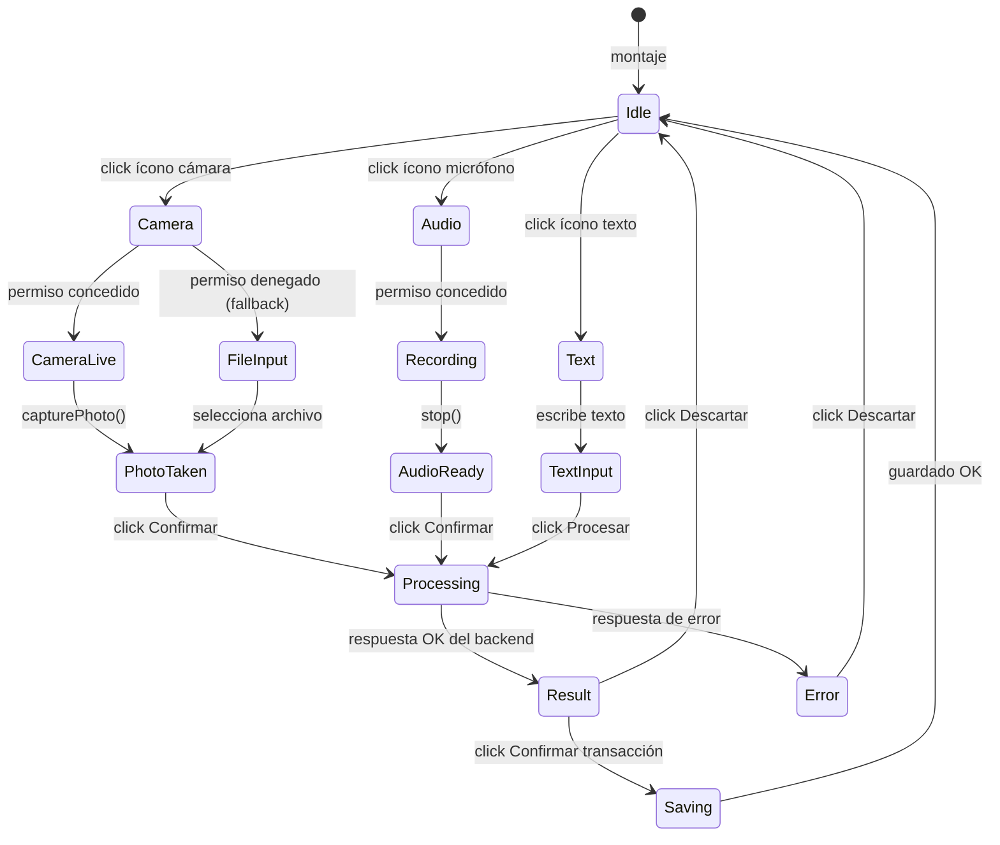

**Flujo de procesamiento:**

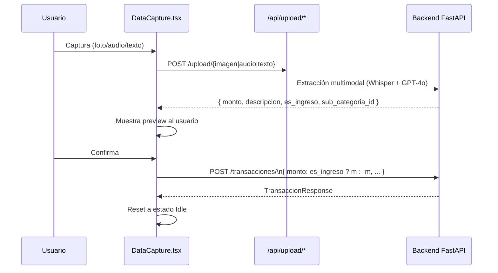

**Estado gestionado:**

```typescript
captureMode: 'none' | 'camera' | 'audio' | 'text'
imageFile: File | null
audioBlob: Blob | null        // tipo audio/webm
textInput: string
result: {
  monto: number,
  descripcion: string,
  es_ingreso: boolean,        // determina signo del monto al guardar
  sub_categoria_id?: number
} | null
isProcessing: boolean
isConfirming: boolean
error: string | null
```

---

### `TransactionList.tsx` — Historial de transacciones

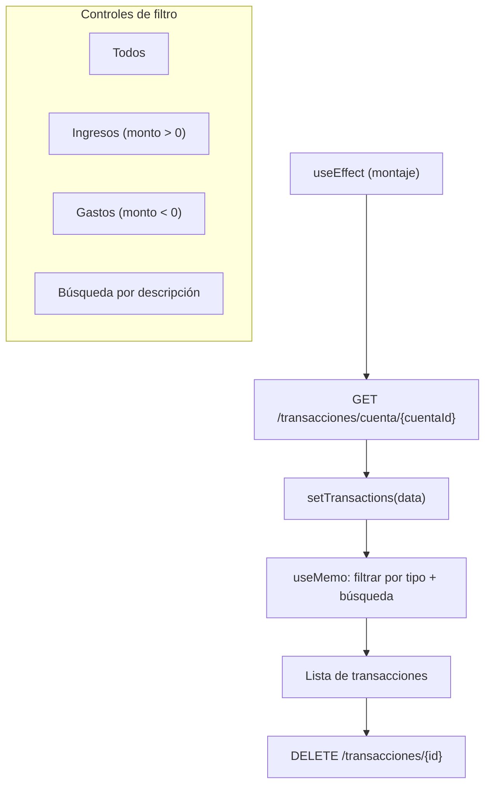

**Lógica de clasificación visual:**

El tipo de transacción (ingreso/gasto) se determina exclusivamente por el **signo del campo `monto`** almacenado en la base de datos:

- `monto > 0` → Ingreso (ícono verde, `+`)
- `monto < 0` → Gasto (ícono rojo, `-`)

**Interfaz `Transaccion`:**

```typescript
interface Transaccion {
  id: string;
  monto: string;               // Decimal serializado como string
  descripcion: string | null;
  fecha_operacion: string;     // ISO 8601
  cuenta_id: string;
  sub_categoria_id: number;
  created_at: string;
}
```

---

### `GoalsDashboard.tsx` — Metas financieras

Gestión completa del ciclo de vida de metas: crear, visualizar progreso, aportar y eliminar.

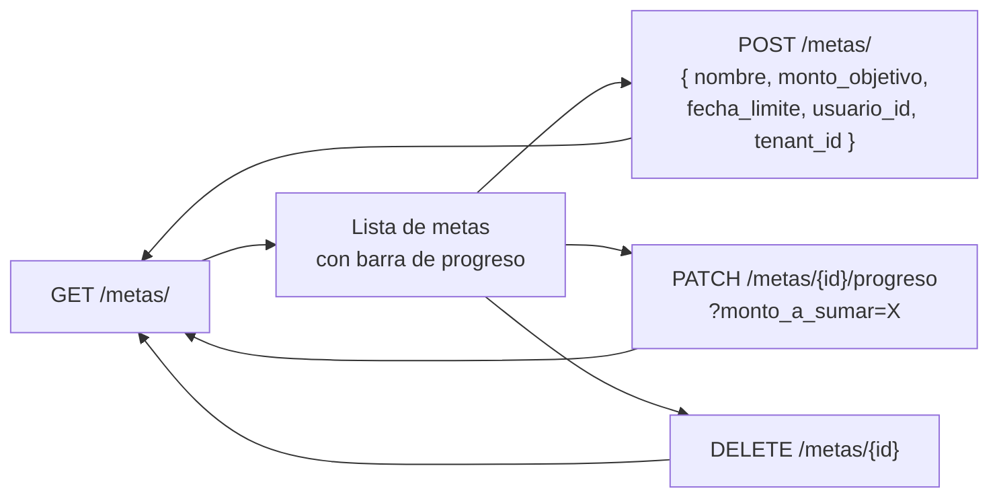

**Cálculo de progreso:**

```typescript
porcentaje = Math.min((progreso_actual / monto_objetivo) * 100, 100)
```

La barra de progreso se anima con CSS (`transition-all duration-700`). Al completarse una meta al 100%, cambia el color de la barra a verde.

---

### `VaultDashboard.tsx` — Bóveda de inversiones

Visualización de gastos por categoría con gráfico de distribución.

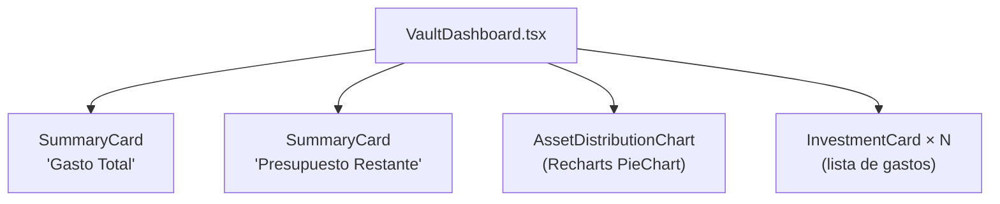

**`AssetDistributionChart.tsx`:** Agrupa los datos por `categoria`, resuelve los colores del tema desde las CSS variables del documento, y renderiza un `PieChart` responsivo de Recharts con tooltip formateado en MXN y leyenda circular.

**`SummaryCard.tsx`:**

```typescript
interface SummaryCardProps {
  title: string;
  value: string;
  subtitle?: string;
  trend?: string;    // Badge con indicador de tendencia
}
```

---

### `GamificationProfile.tsx` — Perfil de gamificación

Visualiza el progreso del usuario en el sistema de XP y niveles.

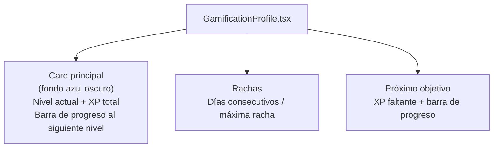

**Niveles del sistema:**

| Nivel | XP requerido |
|-------|-------------|
| Bronce | 0 |
| Plata | 500 |
| Oro | 1,500 |
| Platino | 3,500 |
| Mítico | 7,000 |

---

### `Chat.jsx` — Asesor financiero IA

Interfaz de chat en tiempo real que se conecta al backend por WebSocket.

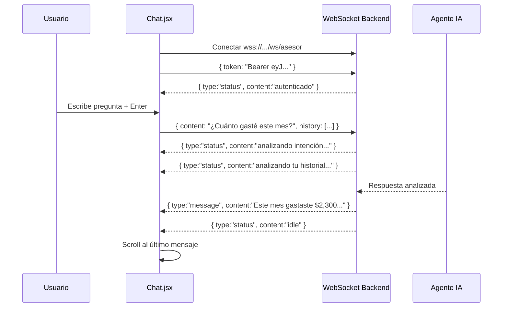

**Manejo de errores de conexión:**
- `code 1006` (cierre abrupto) → muestra mensaje de error del servidor
- El WebSocket se cierra limpiamente en el `cleanup` del `useEffect` para evitar fugas de memoria

**Estado:**

```typescript
messages: Array<{ role: 'user' | 'bot', content: string }>
status: string    // 'idle' | 'analizando intención...' | 'escribiendo...' | error
input: string
isLoaded: boolean   // Clerk SDK cargado
isSignedIn: boolean
```

---

## Sistema de Diseño

### Tokens de diseño (`global.css`)

Economity usa **CSS custom properties** como fuente única de verdad para el sistema visual. Tailwind v4 consume estas variables directamente.

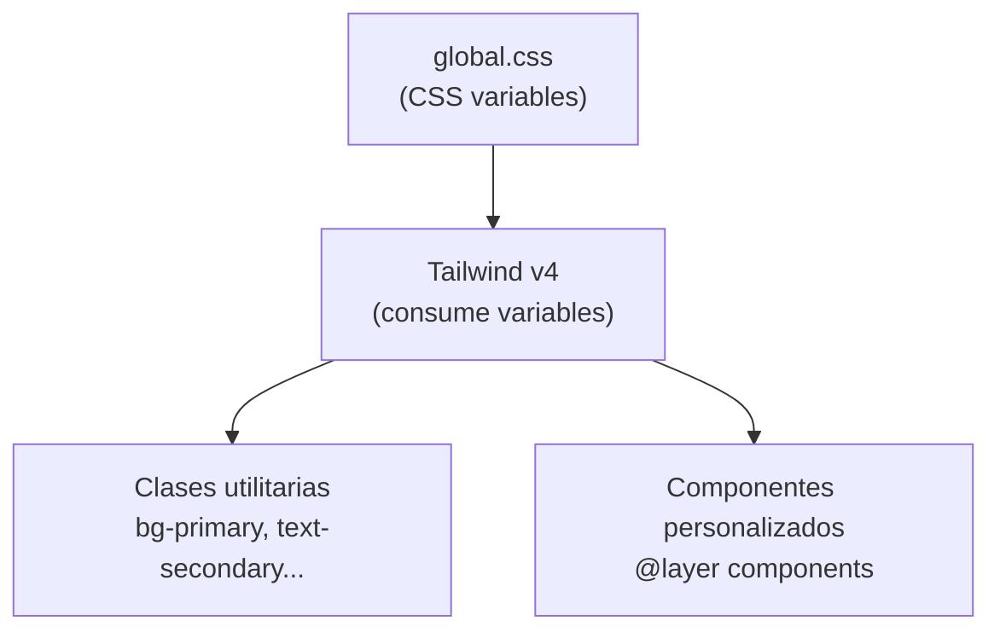

**Paleta de colores:**

| Token | Valor | Uso |
|-------|-------|-----|
| `--color-surface` | `#f7f9fb` | Fondo principal de la app |
| `--color-surface-container-low` | `#f2f4f6` | Tarjetas sobre el fondo |
| `--color-surface-container-high` | `#e0e3e5` | Botones secundarios, chips |
| `--color-primary` | `#000000` | Acciones principales, texto |
| `--color-primary-container` | `#0d1c32` | Card de gamificación (azul oscuro) |
| `--color-secondary` | `#006c49` | Acciones de crecimiento (verde esmeralda) |
| `--color-secondary-fixed-dim` | `#4edea3` | Indicadores positivos |
| `--color-on-tertiary-fixed` | `#68fcbf` | Badges de IA, highlights |

**Tipografía:**

| Variable | Fuente | Uso |
|----------|--------|-----|
| `--font-display` | Manrope | Títulos, logo, valores numéricos grandes |
| `--font-body` | Inter | Cuerpo de texto, etiquetas, inputs |

### Componentes Tailwind personalizados (`@layer components`)

| Clase | Descripción |
|-------|-------------|
| `.btn-primary` | Botón principal con fondo negro y texto blanco |
| `.btn-secondary` | Botón secundario con borde y fondo translúcido |
| `.btn-tertiary` | Botón de texto con underline en hover |
| `.input-field` | Campo de entrada con borde inferior animado en focus |
| `.card-base` | Tarjeta con `border-radius` generoso, fondo surface y padding estándar |
| `.glass-panel` | Panel con efecto glassmorphism (`backdrop-blur`) |
| `.ai-chip` | Badge verde con aura blur para etiquetar funciones de IA |
| `.bg-momentum-glow` | Fondo con gradiente radial para gráficos y destacados |

---

## Comunicación con el Backend

### Mapa completo de llamadas API

| Componente | Método | Ruta | Descripción |
|-----------|--------|------|-------------|
| `api.ts` | `GET` | `/usuarios/{userId}` | Verificar existencia del usuario |
| `api.ts` | `POST` | `/organizaciones/` | Auto-provisionar tenant |
| `api.ts` | `POST` | `/usuarios/` | Auto-provisionar usuario |
| `api.ts` | `GET` | `/usuarios/{id}/cuentas/` | Obtener cuenta principal |
| `api.ts` | `POST` | `/usuarios/{id}/cuentas/` | Crear cuenta por defecto |
| `DataCapture` | `POST` | `/upload/texto` | Extraer datos de texto (preview) |
| `DataCapture` | `POST` | `/upload/audio` | Transcribir y extraer audio (preview) |
| `DataCapture` | `POST` | `/upload/imagen` | Analizar ticket (preview) |
| `DataCapture` | `POST` | `/transacciones/` | Confirmar y guardar transacción |
| `TransactionList` | `GET` | `/transacciones/cuenta/{id}` | Cargar historial |
| `TransactionList` | `DELETE` | `/transacciones/{id}` | Eliminar transacción |
| `GoalsDashboard` | `GET` | `/metas/` | Cargar metas del usuario |
| `GoalsDashboard` | `POST` | `/metas/` | Crear nueva meta |
| `GoalsDashboard` | `PATCH` | `/metas/{id}/progreso` | Añadir progreso |
| `GoalsDashboard` | `DELETE` | `/metas/{id}` | Eliminar meta |
| `Chat.jsx` | `WSS` | `/ws/asesor` | Asesor IA en tiempo real |

### Convención del signo del monto

El frontend es responsable de enviar el monto con el signo correcto al confirmar una transacción:

```typescript
// DataCapture.tsx — al confirmar
monto: result.es_ingreso ? result.monto : -result.monto
```

El backend almacena el valor firmado y el frontend lo interpreta por signo en `TransactionList`:

```typescript
// TransactionList.tsx — al renderizar
const isNegative = parseFloat(t.monto) < 0;  // → gasto (rojo)
```

---

## Chat en Tiempo Real — WebSocket

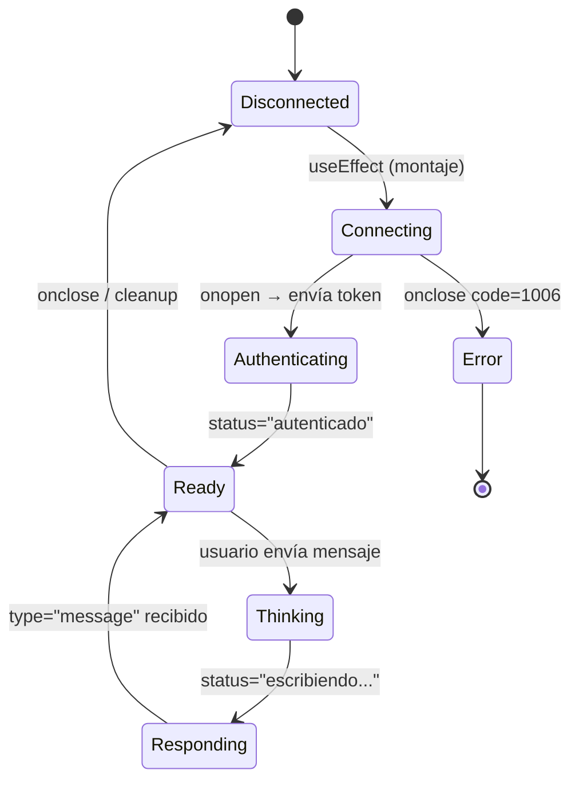

El historial de conversación se envía en cada mensaje para mantener contexto:

```typescript
// Estructura de cada mensaje enviado por WebSocket
{
  content: "¿Cuánto gasté este mes?",
  history: [
    { role: "user", content: "Hola" },
    { role: "assistant", content: "¡Hola! Soy tu asesor..." }
  ]
}
```

El backend limita el historial a los últimos 4 intercambios para no exceder el contexto del LLM.
